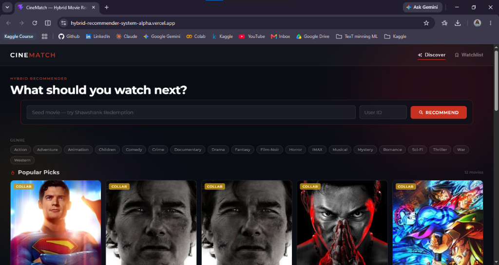

# 🎬 CineMatch — Movie Recommender System (XGBoost Hybrid)

A state-of-the-art hybrid movie recommender system that combines **Content-Based Filtering** (TF-IDF on Overview, Genres, Cast, Director) and **Collaborative Filtering** (Item-Based and User-Based) using a **Machine Learning Ranking Model (XGBoost)** to predict user ratings. Served via a **FastAPI** backend (deployed on **Render**) and a **React + Vite** frontend (deployed on **Vercel**).

### 🔗 Live Links
* **Live Website (Vercel)**: [https://hybrid-recommender-system-alpha.vercel.app/](https://hybrid-recommender-system-alpha.vercel.app/)
* **Backend API Docs (Render)**: [https://hybrid-recommender-system-z6m4.onrender.com/docs](https://hybrid-recommender-system-z6m4.onrender.com/docs)

---

## 🖥️ Live Application Preview


---

## 🏗️ Model Architecture & Algorithms

This recommender system is designed as a **two-stage ranker** similar to industrial engines (e.g., Netflix and YouTube):

```
                       [ User ID + Movie Title ]
                                   │
         ┌─────────────────────────┴─────────────────────────┐
         ▼                                                   ▼
 ┌──────────────┐                                    ┌──────────────┐
 │ Content-Based│                                    │Collaborative │
 │  Filtering   │                                    │  Filtering   │
 └──────┬───────┘                                    └──────┬───────┘
        │ (Similarity Scores)                               │ (Item/User Predictions)
        ▼                                                   ▼
 ┌───────────────────────────────────────────────────────────────────┐
 │                     Feature Extraction Stage                      │
 │  - User/Movie averages (leakage adjusted)                         │
 │  - User rating counts / Movie popularity                          │
 │  - Content / Collaborative Filtering features                      │
 └───────────────────────────────┬───────────────────────────────────┘
                                 │ (Feature Matrix)
                                 ▼
                        ┌─────────────────┐
                        │  XGBoost Ranker │ (Trained Regressor)
                        └────────┬────────┘
                                 │ (Predicted Ratings)
                                 ▼
                       [ Top K Recommendations ]
```

### 🧠 Core Algorithms
1. **Content-Based Filtering (TF-IDF + Cosine Similarity)**:
   * Extracts textual features from movie overviews, genres, cast, and directors using **TF-IDF Vectorization** (Term Frequency-Inverse Document Frequency).
   * Calculates pairwise **Cosine Similarity** between movies to quantify content alignment.
   * Computes a weighted content score (30% Overview, 40% Genres, 15% Director, 15% Cast).
2. **Collaborative Filtering**:
   * **Item-Based Collaborative Filtering**: Measures similarity of rating profiles between movies to predict how a user would rate a movie based on their rating history of similar movies.
   * **User-Based Collaborative Filtering (Matrix Factorization)**: Matches rating behaviors between users to recommend movies liked by users with similar tastes.
3. **XGBoost Rating Ranking Model**:
   * Extracted features (content similarity scores, collaborative filtering scores, leakage-adjusted average ratings, and rating counts) are fed into an **XGBoost Regressor**.
   * The model is trained to predict the exact rating a user would give to candidate movies, sorting the final recommendations dynamically.

### Features Fed to XGBoost:
1. `user_avg_rating`: User's average rating (leakage adjusted).
2. `user_rating_count`: Number of ratings submitted by the user.
3. `movie_avg_rating`: Movie's average rating (leakage adjusted).
4. `movie_rating_count`: Popularity / number of ratings for the movie.
5. `collab_item_score`: Vectorized Item-Based Collaborative Filtering prediction.
6. `collab_user_score`: Vectorized User-Based Collaborative Filtering prediction.
7. `content_score`: Weighted similarity score (30% Overview, 40% Genres, 15% Director, 15% Cast).

---

## 📁 File Structure

```
Recommender file/
├── 01_data_acquisition.ipynb                # Scrapes TMDb credits and metadata
├── 01_Data_Cleaning_and_Recommendation.ipynb # Main training & inference pipeline
├── API/
│   ├── __init__.py
│   ├── main.py                              # FastAPI server — all endpoints
│   ├── requirements.txt                     # Backend dependencies for Render
│   ├── Data/                                # Tracked dataset files (final CSVs)
│   └── models/                              # Tracked trained models & matrices
│       ├── xgboost_hybrid.joblib
│       ├── item_sim_df.joblib
│       ├── user_sim_df.joblib
│       ├── tfidf_*.joblib
│       └── *_matrix.npz
├── frontend/                                # React + Vite UI
│   ├── src/
│   │   ├── App.jsx                         # Main component (Cinematic Glass UI)
│   │   ├── App.css                         # Dark-mode styled CSS
│   │   ├── index.css
│   │   └── main.jsx
│   ├── .env                                 # Environment keys (ignored)
│   └── package.json
├── screenshots/
│   └── cinematch_dashboard.png              # Screenshot of the live application
├── requirements.txt                         # Root Python dependencies
├── .gitignore
└── README.md
```

---

## ⚙️ Installation & Setup (Local)

### 1. Clone the Repository
```bash
git clone https://github.com/Ayesha-Anwar607/Hybrid-Recommender-System.git
cd Hybrid-Recommender-System
```

### 2. Set Up Python Environment
```bash
python -m venv .venv
.venv\Scripts\activate        # Windows
# source .venv/bin/activate   # Linux/macOS

pip install -r requirements.txt
```

### 3. Configure API Keys (Frontend)
Create a `.env` file in the `frontend` folder:
```env
VITE_TMDB_API_KEY=your_tmdb_api_key_here
VITE_API_BASE_URL=http://localhost:8000
```

### 4. Run the Backend API
```bash
python -m API.main
# API is live at: http://localhost:8000
# Swagger docs: http://localhost:8000/docs
```

### 5. Run the Frontend
```bash
cd frontend
npm install
npm run dev
# UI is live at: http://localhost:5173
```

---

## 🔌 API Endpoints

| Method | Endpoint | Description |
|--------|----------|-------------|
| `GET` | `/` | Health check |
| `GET` | `/movie_titles` | Returns all unique, sorted movie titles for search autocomplete |
| `GET` | `/genres` | Returns all unique genres for filter panel |
| `GET` | `/popular?n=12` | Returns top movies ranked by rating/popularity for landing recommendations |
| `GET` | `/hybrid_recommend?user_id=1&movie_title=Inception&top_n=10` | Full hybrid recommendations for user ID + movie |

---

## 📊 Model Evaluation Results

The XGBoost Hybrid Ranker achieves the following performance metrics on the test set:

**Prediction Accuracy (Regression):**
| Metric | Score |
|--------|-------|
| RMSE | `0.7393` — avg prediction error of ~0.74 stars |
| MAE | `0.5522` |
| R² Score | `0.4992` — ~50% explanatory power |

**Ranking Quality (Top-5 Recommendations):**
| Metric | Score |
|--------|-------|
| Average Precision@5 | `0.7809` — ~4 out of 5 recommendations rated 4.0+ |
| Average NDCG@5 | `0.8093` — excellent ranking alignment |

---

## 🛠️ Tech Stack

| Layer | Technology |
|-------|-----------|
| ML / Training | Python, Scikit-learn, XGBoost, Pandas, NumPy, SciPy |
| Backend API | FastAPI, Uvicorn |
| Frontend | React, Vite, CSS (Cinematic Glass UI) |
| Hosting | Render (Backend API), Vercel (Frontend Client) |
| Data Source | MovieLens (GroupLens), TMDb API |

---

## 🚀 Future Plans & Expansion Roadmap

### 📡 Live Streaming Data Integration
- Replace static CSV datasets with **real-time data pipelines** using **Apache Kafka** or **AWS Kinesis** to ingest live user events (ratings, clicks, watch history).
- Update user and item embeddings **on-the-fly** without full model retraining — enabling the system to adapt to trends as they happen (e.g., viral movies, new releases).
- Integrate with **TMDb's live API** to automatically pull new movie metadata as films are released.

### ⚡ Distributed & Parallel Computing for Scale
As the user base and dataset grow, the current single-machine setup becomes a bottleneck. The roadmap includes:
- **Apache Spark (PySpark)** — Distribute training data processing and similarity matrix computation across a cluster.
- **Apache Hadoop (HDFS)** — Use HDFS as a distributed file system to store and access massive datasets.
- **Kubernetes (K8s)** — Containerize the FastAPI backend with Docker and orchestrate auto-scaling with Kubernetes to handle sudden traffic spikes with low latency.
- **Horizontal API Scaling** — Deploy multiple replicas of the API server behind a load balancer.

### 🧠 Model Improvements
- **Deep Learning Recommenders** — Experiment with Neural Collaborative Filtering (NCF) or two-tower models (similar to YouTube DNN).
- **Session-Based Recommendations** — Use transformer-based models (e.g., BERT4Rec, SASRec) to capture sequential user behavior.
- **Graph Neural Networks (GNNs)** — Model user-movie interactions as a bipartite graph and use GNNs (e.g., LightGCN).

---

## 📝 License

This project is open-source and available under the [MIT License](LICENSE).
